https://doi.org/10.1038/s41893-020-0591-9

# Rational design of perfluorocarbon-free oleophobic textiles

Sadaf Shabanian, Behrooz Khatir, Ambreen Nisar, and Kevin Golovin

Water- and oil-repellent fabrics have global application within the textile industry and as technical apparel. Fabric finishes utilizing perfluoro compounds (PFCs) are known to uniquely render textiles both water and oil repellent. However, PFC-based finishes are not sustainable because they compromise environmental and human health, and garment factories have accordingly begun to phase out PFC usage. This is problematic, as all previous studies on fabric finishes indicate that oil repellency cannot be achieved without perfluorination. Here we develop design parameters for fabricating oil-repellent textile finishes using PFC-free surface chemistries. By adding a secondary, smaller length-scale texture to each fibre of a given weave, robust oil repellency is achievable when the texture size, spacing and surface chemistry are properly controlled. For example, a PFC-free, oil-repellent jacket fabric is fabricated that exhibits oleophobicity towards canola, olive and castor oil in addition to synthetic sweat. The textile remains non-wetted for liquids with surface tension as low as 23.9 mN m-1. The equations developed in this work allow for the rational design of oil-repellent textile finishes that do not utilize perfluorinated substances.

he repellency of water, oil and staining liquids is important to the textile industry, including for clothing, carpeting, upholstery and technical apparel1. Oil-repellent textiles are desirable because they can be easy to clean, reduce upkeep expenses, maintain the natural appearance of the fabric and improve air permeability and chemical resistance2. Because all textile materials are intrinsically wetting to oils, or oleophilic, they will imbibe the liquid upon contact3. Increasing the oleophobic properties of textiles typically involves applying a low surface energy,  $\gamma_{SV}$ , fabric finish4. Long-chain perfluoro-compound- (PFC-) based finishes, due to their low surface energy ( $\gamma_{SV} \approx 10-20$  millinewtons (mN) m-1 (ref. 4)), can render textiles both water and oil repellent with excellent durability5. However, PFC-based finishes pose substantial health and environmental concerns4,6–9. Due to their higher surface energy  $(\gamma_{SV} \approx 24-35 \,\mathrm{mN \, m^{-1}})$ , PFC-free surface treatments have never proven oil repellent4. To the best of our knowledge, every PFC-free fabric reported to date has been wetting to oils10-17, and their oil absorptivity has often been touted for its utility in separating oil/ water mixtures14-19. However, wettability theory indicates that oil repellency should be possible if a fabric's surface architecture is carefully designed in concert with the surface chemistry20,21.

Treating fabrics with long-chain perfluorocarbon chemistry imparts a very low surface energy and results in high water-contact angles and low water roll-off angles21–26. However, the toxicity of long-chain PFC-based water repellents is well documented, especially for the two most prevalent by-products, perfluorooctane sulfonic acid and perfluorooctanoic acid, which enter the environment during the fabric finishing process or via degradation over time6–9. PFC degradation by-products are extremely persistent, with some requiring hundreds of years to break down27. As such, they've been found in some of the remotest places on Earth, including in the snows of the Haba Snow Mountains (5,053 m above sea level)28 and within the livers of polar bears29.

In response to these environmental concerns, and subsequent legal action by several governmental agencies9, textile manufacturers have begun using shorter-chain PFC chemistries, which utilize 6-long or 4-long perfluorinated carbon chains30-33. Not only are the by-products of short-chain PFCs still toxic, these chemistries also exhibit inferior surface functionality compared with their long-chain counterparts, especially in terms of oil repellency7-9. The outlawing of these shorter-chain substances has already begun, for example, the German proposed ban of 'Undecafluorohexanoic acid (PFHxA), its salts and related substances'34. W. L. Gore, the manufacturer of GoreTex, created the 'Gore Fabrics' Goal and Roadmap to Eliminate PFCs of Environmental Concern'35, which provides milestones for eliminating PFCs from the apparel supply chain by 2023. However, the Gore Fabrics' plan is careful to distinguish PFCs of 'environmental concern', differentiating materials such as polytetrafluoroethylene from the toxic PFCs. The Sustainable Apparel Coalition was founded in 2012 to inject sustainability into the textile industry through the Higg Index, which includes the elimination of PFCs. In summary, there is a clear, global push to remove PFCs from the apparel industry even without a definitive, oil-repellent replacement finish.

Here we develop design parameters for fabricating robust, oil-repellent textile finishes that do not use perfluorinated compounds. We demonstrate robust oil repellency when the size, spacing and surface chemistry of both the fabric and an additional, smaller length-scale texture are properly controlled. A non-fluorinated, oleophobic jacket fabric is fabricated that repels oils, including canola, olive and castor, along with synthetic sweat. Liquids with surface tension as low as 23.9 mN m-1 are repelled by the fabric. The rational design of oil-repellent textile finishes that do not use perfluorinated substances is possible using the equations developed herein.

### Results

It is important to note that much of the theory delineated in the following builds from the excellent works of Kleingartner et al.21, Michielsen and Lee36 and Kota et al.37. In addition, PFC-free oil repellency has been achieved in silico with complex topographies such as micro-hoodoos or doubly re-entrant texture38. However,

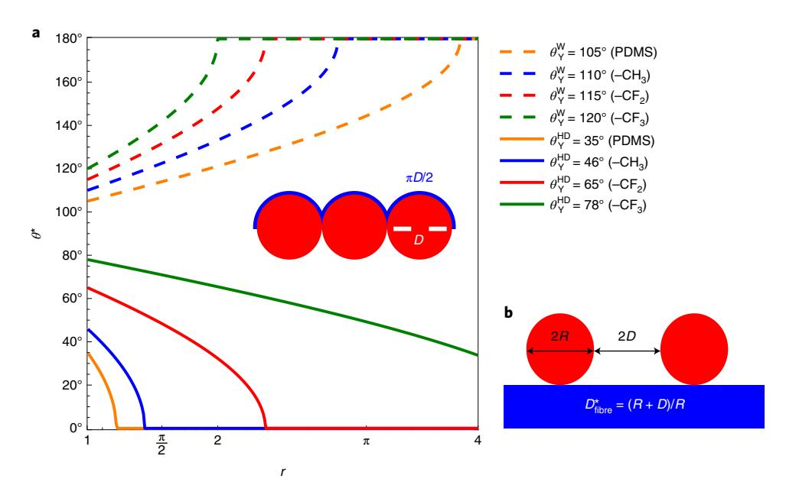

**Fig. 1 | Contact angle of wetted fabrics. a**, Apparent contact angle of water (W) and hexadecane (HD) on fibres in terms of the fabric's Wenzel roughness for four different surface chemistries:  $-CF_3$ ,  $-CF_3$ ,  $-CF_3$ ,  $-CF_3$ , and PDMS. The values for the equilibrium contact angles are taken from Shafrin and Zisman45. The inset shows the Wenzel roughness of a tightly woven fabric. **b**, A schematic depicting the dimensions for the porosity parameter for fabrics,  $D_{\text{fibre}}^*$ .

the design principles for such surface architectures cannot be applied to textiles, and even more complex topographies are necessary to prevent wetting in the presence of any defects or nonuniformity39, both of which are unavoidable considering the scale of the textile industry.

**Designing fabrics with high oil-contact angles.** When a liquid contacts a smooth, solid surface, it adopts an equilibrium contact angle,  $\theta_{Y}$ , given by Young's relation,  $\cos\theta_{Y} = (\gamma_{SV} - \gamma_{SL})/\gamma_{LV}^{40}$ . Here  $\gamma_{SL}$  is the solid–liquid interfacial energy and  $\gamma_{LV}$  is the liquid's surface tension. Textiles are composed of either woven or non-woven fibers and are thus inherently not smooth. Wenzel first proposed that the roughness of the surface, that is, the actual solid–liquid contact area divided by the projected area, denoted r, amplifies the inherent wettability of the surface through  $\cos\theta' = r \cos\theta_{Y}^{41}$ . For water, both hydrophobic ( $\theta_{Y} > 90^{\circ}$ ) and hydrophilic ( $\theta_{Y} < 90^{\circ}$ ) chemistries exist, allowing surfaces to be fabricated with a wide range of apparent contact angles,  $\theta'$ . However, for low surface tension liquids such as oils, oleophobic ( $\theta_{Y} > 90^{\circ}$ ) chemistries do not exist, and therefore roughness will only decrease the observed contact angle.

A tightly woven textile exhibits a Wenzel roughness approaching  $r=\pi/2$  (Fig. 1a, inset). Figure 1a makes it readily apparent why non-fluorinated surface chemistries cannot be used to repel low-surface-tension liquids, in this case hexadecane, in the Wenzel state. For  $r \ge 1.4$ , hexadecane exhibits an apparent contact angle of  $\theta^* = 0^\circ$  for all non-fluorinated surface chemistries. As such, achieving oil repellency without the use of perfluorination necessitates that the roughness of the textile not be completely wetted by the low-surface-tension liquid. Note that throughout this paper, hexadecane  $(\gamma_{\rm LV} \approx 27.47\,{\rm mN\,m^{-1}}$  (ref.  $^{42}$ )) will be used as a representative low-surface-tension oil as it is commonly used in the literature  $^{20,43,44}$ . However, additional design diagrams for liquids with both higher surface tension (tert-butylnaphthalene,  $\gamma_{\rm LV} \approx 33.7\,{\rm mN\,m^{-1}}$  (ref.  $^{45}$ ), similar to canola oil oil on and lower surface tension (decane,  $\gamma_{\rm LV} \approx 23.83\,{\rm mN\,m^{-1}}$  (ref.  $^{42}$ )) are given in Extended Data Figs. 1–4.

The Cassie–Baxter relation47,  $\cos\theta^* = \sum f_i\theta_i$ , describes the apparent contact angle adopted on a surface composed of multiple surface chemistries, where  $\theta_i$  is the Young's contact angle for surface

chemistry *i*, whose total contact line length is given by  $f_i$ . If a region of the surface remains non-wetted underneath a droplet, the liquid stays in contact with air. Increasing this fraction of air is the only way to increase the apparent contact angle for low-surface-tension liquids ( $\theta_{\rm Y}$ <90°). For cylindrical fibres, the texture of the surface may be characterized by the porosity parameter,  $D_{\rm fibre}^* = (R+D)/R$  (Fig. 1b), where 2*D* is the spacing between fibres and 2*R* is the fibre diameter. Large values of  $D_{\rm fibre}^*$  indicate fabrics with high inherent porosity. For textiles, the Cassie–Baxter relation can be rewritten for the apparent contact angle on fibres,  $\theta_{\rm fibre}^*$ , as37:

$$\cos \theta_{\text{fibre}}^* = -1 + \frac{1}{D_{\text{fibre}}^*} [\sin \theta_{\text{Y}} + (\pi - \theta_{\text{Y}}) \cos \theta_{\text{Y}}] \qquad (1)$$

Here  $\theta_{\rm v}$  is the Young's contact angle of the fibre surface chemistry. In Fig. 2a we plot the apparent contact angle of hexadecane on fibres treated with four representative surface chemistries, including polydimethylsiloxane (PDMS), alkyl (-CH3), fluorinated (-CF2) and perfluorinated (-CF3), against the porosity of the fibres. Although equation (1) indicates that contact angles up to  $\theta_{\text{fibre}}^* = 180^{\circ}$  are observable for any liquid, given some critical value of  $D_{\text{fibre}}^*$ , textiles do not often exhibit such porosity. For example, we examined the porosity of 20 common fabric weaves48 (Supplementary Table 1) and found that the majority of the textiles exhibit a porosity near  $D_{\text{fibre}}^* \approx 4$ , and none exhibit  $D_{\text{fibre}}^* > 9$ . As such,  $\theta^*$  on chemically modified textiles is limited, especially for non-fluorinated systems. For example, the maximum observable hexadecane contact angle for a satin regular weave ( $D_{\rm fibre}^* \approx 8.1$ ) treated with a silicone- (PDMS-) based finish is  $\theta^* = 132^\circ$ . The observable hexadecane contact angle for most other weaves  $\left(D_{\mathrm{fibre}}^{\star} \approx 4\right)$  is even lower  $(\theta^{\star} \approx 110^{\circ})$  for non-fluorinated chemistries. Fluorinated systems always achieve a non-zero contact angle with hexadecane (Fig. 2a), even for close-packed fibres  $(D_{\text{fibre}}^* = 1)$ , highlighting why PFC-based finishes have been so successful at achieving oil repellency in the past.

Increasing the amount of air in contact with a liquid will raise the apparent contact angle in the Cassie–Baxter state. Although the porosity of common textiles is limited (Supplementary Table 1), adding a second layer of finer texture circumvents this issue.

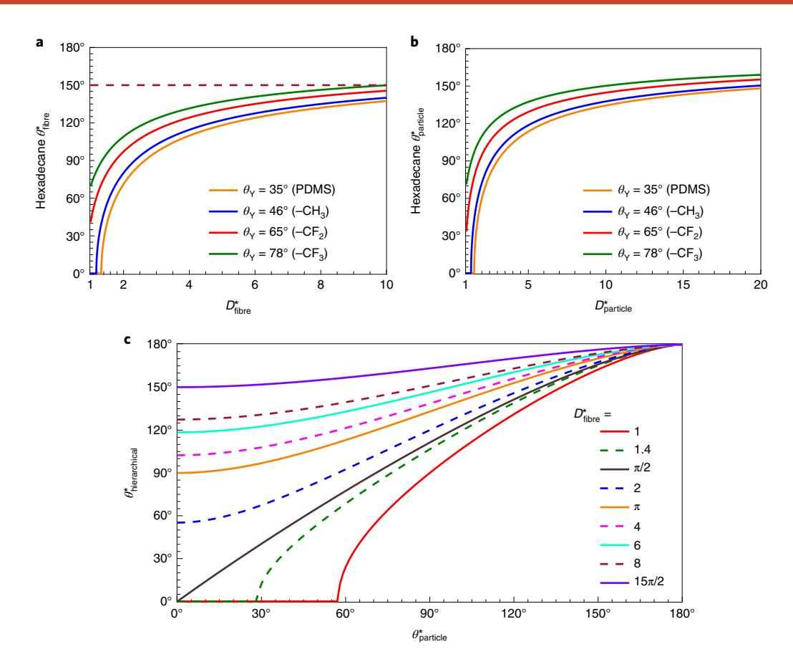

**Fig. 2** | Wettability of non-wetted fibres, particles and particles decorating fibres. **a,b**, Apparent contact angle of hexadecane on fibres (**a**) and particles (**b**), in terms of the porosity, for four different surface chemistries. Notice that typical fabrics  $(D_{\text{fibre}}^* < 9)$  cannot become superoleophobic  $(\theta_{\text{fibre}}^* \ge 150^\circ)$  with PFC-free surface chemistry. **c**, The apparent contact angle observed on hierarchical fabrics of varying porosity, in terms of the apparent contact angle observed solely on the particles. Whereas **a** and **b** are specific to hexadecane, **c** holds for any liquid.

The contact angle observed on a smooth surface decorated with spherical particles,  $\theta_{\text{particle}}^{\dagger}$ , may be written as37:

$$\cos \theta_{\text{particle}}^* = -1 + \frac{\pi (1 + \cos \theta_{\text{Y}})^2}{2\sqrt{3}D_{\text{particle}}^*}$$
 (2)

where  $D_{\text{particle}}^{\star}$  is the porosity of the particles, defined by  $D_{\text{particle}}^{\star} = \begin{bmatrix} 1 + D_{\text{particle}}/R_{\text{particle}} \end{bmatrix}^2$ .

Here  $2D_{\text{particle}}$  is the inter-particle spacing and  $R_{\text{particle}}$  is the particle radius. For a hierarchical texture where these spherical particles decorate the surface of cylindrical fibres, the apparent contact angle can be found recursively using37:

$$\cos \theta_{\text{hierarchical}}^* = -1 + \frac{1}{D_{\text{fibre}}^*} \left[ \sin \theta_{\text{particle}}^* + \left( \pi - \theta_{\text{particle}}^* \right) \cos \theta_{\text{particle}}^* \right]$$
(3)

Here  $\theta_{\text{hierarchical}}^*$  is the observed contact angle on the particle-decorated fibres. Dissimilar to fabrics, there are no industrial limitations on the porosity of the particles decorating each fibre (Fig. 2b). Considering both fibre and particle porosity together, a design diagram of the resultant observable contact angle can be constructed for a given  $\theta_{\text{particle}}^*$ , for various fabric constructions (varying  $D_{\text{fibre}}^*$ , Fig. 2c). Oleophobic ( $\theta_{\text{hierarchical}}^* > 90^\circ$ ) or superoleophobic ( $\theta_{\text{hierarchical}}^* > 150^\circ$ ) textiles with known  $D_{\text{fibre}}^*$  may be designed by determining the  $\theta_{\text{particle}}^*$  required to achieve that level of oil repellency. For example, for  $1 \leq D_{\text{fibre}}^* < \pi/2$  there is a minimum

 $\theta_{\mathrm{particle}}^*$ , and consequently a minimum  $D_{\mathrm{particle}}^*$ , required to achieve a non-zero  $\theta_{\mathrm{hierarchical}}^*$ , regardless of the surface chemistry. Conversely, for  $D_{\mathrm{fibre}}^* \geq \pi$ , an oleophobic fabric can be obtained for all values of  $\theta_{\mathrm{particle}}^*$ . Note that, in this work we make no distinction between monofilament and multifilament fabrics, but the same recursive procedure37 may be used if one wishes to consider bundles of fibres within a weave.

Designing fabrics with robust oil repellency. For low-surface-tension liquids, the Cassie–Baxter state is metastable, and pressure can cause droplets to transition from the non-wetted to the wetted Wenzel state. The robustness parameter,  $A^*$ , was previously developed as a measure of the capillary resistance that a surface exhibits against transitioning from the Cassie state to the Wenzel state37.  $A^*$  is defined as the pressure required to force a wetting transition,  $P_{\text{breakthrough}}$ , divided by a reference pressure,  $P_{\text{ref}}$ . For cylindrical fibres of radius  $R_{\text{fibre}}$ ,  $A^*_{\text{fibre}}$  is given by37:

$$A_{\mathrm{fibre}}^{\star} = \frac{P_{\mathrm{breakthrough}}}{P_{\mathrm{ref}}} = \frac{\ell_{\mathrm{cap}}}{R_{\mathrm{fibre}} \left(D_{\mathrm{fibre}}^{\star} - 1\right)} \frac{\left(1 - \cos \theta_{\mathrm{Y}}\right)}{\left(D_{\mathrm{fibre}}^{\star} - 1 + 2\sin \theta_{\mathrm{Y}}\right)} \tag{4}$$

The reference pressure is defined as the Laplace pressure of a droplet whose radius is equal to the capillary length of the liquid,  $\ell_{\rm cap}$ , or  $P_{\rm ref} = 2\gamma_{\rm LV}/\ell_{\rm cap}$ , where  $\ell_{\rm cap} = \sqrt{\gamma_{\rm LV}/\rho g}$  (ref. 20). Here  $\rho$  is the liquid density and g is the acceleration due to gravity.

Values of  $A^* < 1$  indicate that the surface texture is unable to support the Cassie–Baxter state. Robust, liquid-repellent surfaces

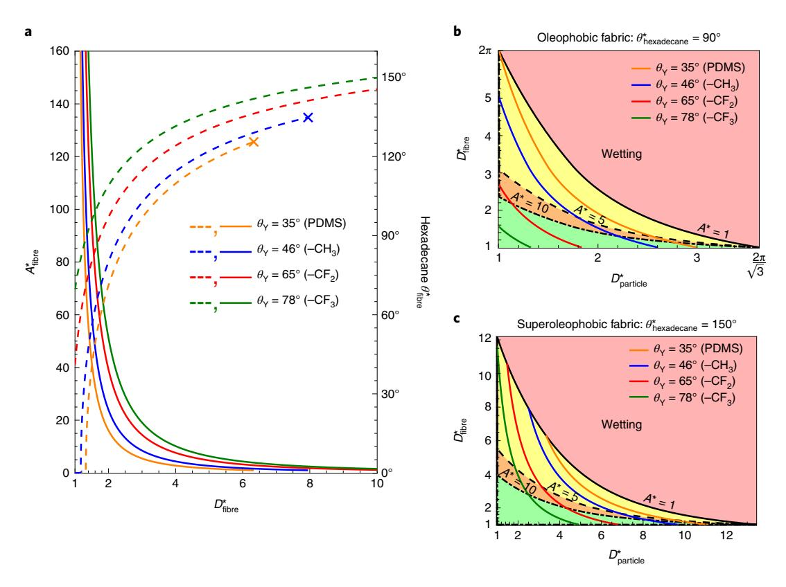

**Fig. 3 | Design of robust, oil-repellent fabrics. a,** Robustness factor (solid lines) and apparent contact angle (dashed lines) of hexadecane for four different surface chemistries in terms of the porosity of the fibres. The 'x' denotes when A' <1 has been reached. **b,c**, Phase diagrams for designing robust oleophobic (**b**) and superoleophobic (**c**) fabrics as a function of the fibre and particle porosity. Porosity combinations within the red region will lead to complete wetting. For a specified fabric (constant value of  $D^*_{\text{fibre}}$ ), achieving robust oleophobic or superoleophobic properties with PFC-free chemistries is only possible for a very limited range of  $D^*_{\text{narticle}}$ .

should be designed such that  $A^*>>1$ . In Fig. 3a we plot both the robustness parameter and the apparent contact angle of hexadecane atop cylindrical fibres for four different surface chemistries. For both wax- and silicone-based chemistries,  $A^*$  drops below unity well before the apparent contact angle reaches  $\theta^*_{\text{fibre}} = 150^\circ$ . Thus, even for highly porous fabrics not common in the apparel industry (Supplementary Table 1), a superoleophobic textile is not possible solely with PFC-free surface chemistry.

It has been previously argued that the addition of particles atop an underlying texture does not impact the robustness of the non-wetted interface37. However, if the particles are non-wetted, the meniscus on the fibres will sit at  $\theta_{\text{particle}}^*$  and not  $\theta_{\text{p}}$ , which does impact the overall capillary resistance of the textile (Extended Data Fig. 5). Hence, for spherical particles decorating the surface of cylindrical fibres, the robustness of the Cassie state is given by:

$$A_{\text{hierarchical}}^{*} = \frac{P_{\text{breakthrough}}}{P_{\text{ref}}}$$

$$= \frac{\ell_{\text{cap}}}{R_{\text{fibre}} \left(D_{\text{fibre}}^{*} - 1\right) \left(D_{\text{fibre}}^{*} - 1 + 2\sin\theta_{\text{particle}}^{*}\right)}$$
(5

Although not readily apparent, the restriction of  $A^*>1$  limits the porosity of both the fibres and particles if a certain apparent contact angle is desired. Equation 5 can be rewritten to give the maximum  $D_{\text{fibre}}^*$  for a given  $\theta_{\text{particle}}^*$  as (Supplementary Note 3):

$$D_{\mathrm{fibre\_max}}^{\star} = 1 - \sin\theta_{\mathrm{particle}}^{\star} + \sqrt{\sin^{2}\theta_{\mathrm{particle}}^{\star} + \frac{\ell_{\mathrm{cap}} \left(1 - \cos\theta_{\mathrm{particle}}^{\star}\right)}{A_{\mathrm{hierarchical}}^{\star} R_{\mathrm{fibre}}}}$$

Equation 6 is useful in the following way. Consider a PFC-free, particle-based finish that, when deposited on a smooth substrate, leads to  $\theta_{\text{particle}}^* = 60^\circ$  with hexadecane (oleophilic, but non-spreading). Assuming a typical fibre diameter of  $2R_{\text{fibre}} = 20\,\mu\text{m}$ , a fabric would only adopt the Cassie–Baxter state with hexadecane when  $D_{\text{fibre}}^* < 10$ . This includes most textile weaves (Supplementary Table 1). However, for  $D_{\text{fibre}}^* = 10$ , any additional pressure perturbations would cause a wetting transition, as would deposition of any liquid exhibiting a lower contact angle than hexadecane. A robust  $(A^* = 10)$  fabric would necessitate  $D_{\text{fibre}}^* < 3.3$ , yet most common weaves exceed this. As such, different fabric constructions may require different fabric finishes to achieve the same level of oil repellency. A finish that imparts oil repellency for one fabric may not render other, more-open fabric constructions, oleophobic.

## Discussion

One measure of oil repellency used worldwide is AATCC (American Association of Textile Chemists and Colorists) 118: Oil Repellency: Hydrocarbon Resistance Test49. In this standard, maximal oil repellency is reported when a gently deposited heptane ( $\gamma_{\rm LV}\approx 20.1\,{\rm mN\,m^{-1}}$ ) droplet does not wet ( $A^*>1$ ) the fabric after 30 s. Consider a particle-based finish for which  $\theta^*_{\rm particle}=35^\circ$  with heptane ( $\ell_{\rm cap}=1.7\,{\rm mm}$ ) when coated on a smooth substrate. Assuming  $R_{\rm fibre}=10\,{\rm \mu m}$ , a fabric finished with this material would repel heptane only when  $D^*_{\rm fibre}<6$ , using equation 6. Assuming a wax-based surface chemistry, this is equivalent to a hexadecane robustness parameter of  $A^*\approx 3.1$  (Supplementary Note 3); that is, one can design for the repellency of other liquids by adjusting  $A^*$  in equation 6.

**Table 1** | Calculated and measured apparent contact angles of water and hexadecane on PDMS-treated meshes with varying porosity  $(D^* = D^*_{\text{fibre}})$  and robustness parameter (A')

| Mesh    |         |     | Water                    |                            | Hexadecane                 |                      |                |
|---------|---------|-----|--------------------------|----------------------------|----------------------------|----------------------|----------------|
| 2R (μm) | 2D (μm) | D.  | $	heta^\star$ equation 1 | $	heta^{\star}$ (measured) | $	heta^{\star}$ equation 1 | $	heta^*$ (measured) | A * |
| 36      | 43      | 2.2 | 136°                     | 144° ± 2°                  | 78 <b>°</b>                | 79° ± 4°             | 6.9            |
| 25      | 38      | 2.5 | 139°                     | 143° ± 3°                  | 87°                        | 72 <b>°</b> ± 4°     | 6.8            |
| 28      | 51      | 2.8 | 141°                     | 142° ± 1°                  | 93 <b>°</b>                | 95° ± 3°             | 4.6            |

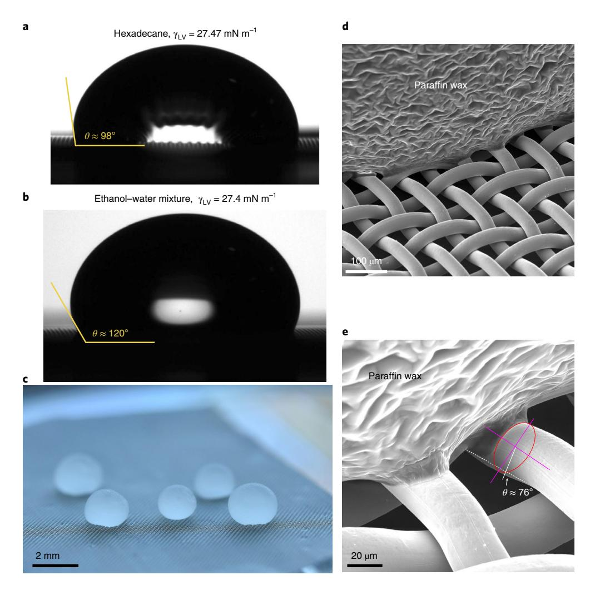

**Fig. 4 | Oleophobic metal meshes. a,b**, 15  $\mu$ l droplets of hexadecane (**a**) and an ethanol-water mixture ( $\gamma_{\text{LV}} = 27.4 \text{ mN m}^{-1}$ ) (**b**) exhibiting  $\theta$ '  $\approx 98^{\circ}$  and  $\theta$ '  $\approx 120^{\circ}$ , respectively, on a PDMS-treated mesh ( $D_{\text{fibre}}^{*} = 2.8$ ). **c**, Optical image of solidified paraffin wax droplets on the PDMS-treated mesh. **d,e**, Low-resolution (**d**) and high-resolution (**e**) SEM images of the meniscus of a solidified paraffin wax droplet on a PDMS-treated mesh ( $D_{\text{fibre}}^{*} = 2.2$ ) exhibiting a local contact angle of  $\theta = 76^{\circ}$ .

If one defines an oleophobic fabric as one exhibiting  $\theta_{\text{hierarchical}}^* \ge 90^\circ$  and  $A_{\text{hierarchical}}^* \ge 1$ , a phase diagram can be constructed relating  $D_{\text{particle}}^*$  and  $D_{\text{fibre}}^*$  by combining equations (2), (3) and (6). Phase diagrams for oleophobic and superoleophobic  $(\theta_{\text{hierarchical}}^* \ge 150^\circ)$  fabrics are shown in Fig. 3b,c, assuming a fibre diameter of  $2R_{\text{fibre}} = 20\,\mu\text{m}$  (diagrams for other fibre radii may be found in Extended Data Fig. 6). The curves for the four finish chemistries shown are curves of constant apparent contact angle. For a given  $D_{\text{fibre}}^*$  (that is, a specific textile construction), moving to the right of a finish chemistry curve indicates fabrics exhibiting higher contact angle but lower robustness, until the wetting region

is reached. Conversely, moving left of a chemistry curve denotes textiles with lower contact angles but greater capillary resistance.

Notice that, by stipulating a specific contact angle, very limited ranges of  $D_{\rm particle}^*$  result in oleophobic or superoleophobic fabrics for a given porosity of fibres, especially for the non-fluorinated textile chemistries. For example, for a plain weave  $(D_{\rm fibre}^*=2+\sqrt{2}\approx 3.4)$  (Supplementary Note 1), an alkyl-based finish must exhibit a particle porosity of  $D_{\rm particle}^*>1.25$  to achieve oleophobicity, but a particle porosity of  $D_{\rm particle}^*>1.68$  will cause the fabric to be wetted by hexadecane. Achieving superoleophobicity requires an even more precise finish formulation. For a herringbone twill weave

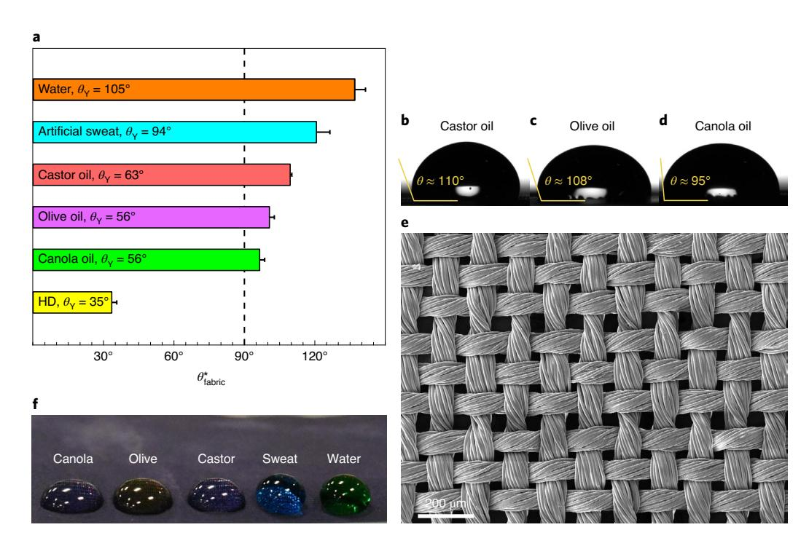

**Fig. 5 | Oleophobic fabrics. a**, Apparent contact angles of hexadecane, canola oil, olive oil, castor oil, artificial sweat and water on the PDMS-treated jacket fabric. Error bars denote one standard deviation ( $N \ge 6$ ). **b-d**, Goniometer images of droplets of caster oil (**b**), olive oil (**c**) and canola oil (**d**) on the PFC-free, oleophobic jacket fabric. **e**, SEM image of the nylon jacket fabric. **f**, Optical image of several liquid droplets ( $40 \mu$ l) being repelled by the PDMS-treated jacket fabric. Sweat and water were dyed using food colouring for visualization purposes only.

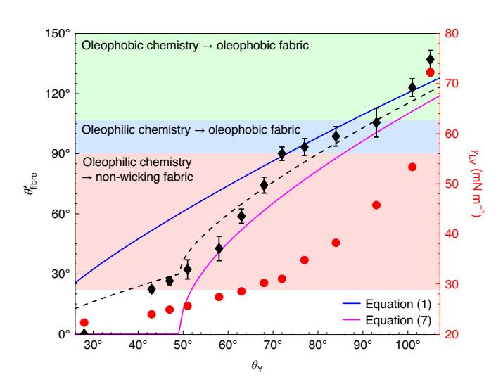

**Fig. 6 | Predicting fabric oleophobicity.** The apparent contact angle (black diamonds) of droplets of ethanol-water mixtures on a PDMS-treated jacket fabric ( $D_{\rm fibre}^*$ =1.5) and the surface tension of the mixture (red circles), in terms of the surface chemistry's equilibrium contact angle,  $\theta_Y$ . Ethanol-water mixtures with a surface tension as low as  $\gamma_{\rm LV}$ =23.9 mN m-1 adopted non-zero contact angles ( $\theta_{\rm fibre}^*$   $\approx$  22°) on the PDMS-treated jacket fabric. The dashed line is an equally weighted average of equations (1) and (7), that is, when half the yarns along the contact line are dry. Error bars denote one standard deviation ( $N \ge 6$ ).

 $(D_{\mathrm{fibre}}^*=3.7)$ , Supplementary Table 1) to achieve superoleophobicity using a PDMS-based finish, the porosity of the particle-based coating must be  $4.7 \leq D_{\mathrm{particle}}^* \leq 5.4$ . These precise restrictions on the secondary layer of texture are probably why every PFC-free finish to date has been wetting to oils10–12. Figure 3c also indicates that a

superoleophobic fabric cannot be achieved with a PFC-free finish for  $D_{\rm fibre}^* > 7.9$ , although from the common weaves examined here, this would exclude only the satin regular weave (Supplementary Table 1).

We used the preceding framework to experimentally fabricate PFC-free yet oleophobic textiles, including monofilament woven meshes and a nylon jacket fabric composed of woven yarns (see Methods). Stainless steel woven meshes were first explored to validate the preceding theory due to their extremely regular  $D_{\rm fibre}^*$  values. Three mesh constructions were selected and subsequently treated with a PDMS-based finish ( $\theta_{\rm Y} = 35^{\circ}$  with hexadecane). The wettability of the meshes was studied by measuring the contact angles of water and hexadecane using the sessile droplet technique (Table 1).

Without the PDMS-based finish, all three meshes were completely wetting to hexadecane ( $\theta^*$ =0°), as expected. With the finish, non-zero hexadecane apparent contact angles were observed, up to as high as  $\theta^*$ =98° for  $D_{\rm fibre}^*=2.8$  (Fig. 4a). A droplet of an ethanolwater mixture ( $\theta_{\rm Y}$ =58°), matching the surface tension of hexadecane ( $\gamma_{\rm LV}$ =27.4 mN m-1), exhibited  $\theta^*$  ≈ 120° on this mesh (Fig. 4b), demonstrating that  $\theta_{\rm Y}$  is more important than surface tension for repellency considerations.

To directly image the non-wetting state of the PFC-free, oil-repellent finish, a droplet of molten paraffin wax was deposited on the PDMS-treated mesh (Fig. 4c). After solidifying, scanning electron microscope (SEM) imaging (Fig. 4d,e) confirmed that the position of the meniscus ( $\theta$ =76°) closely matched the contact angle of molten paraffin observed on a smooth PDMS-treated surface ( $\theta_Y$ =74°). An underlying assumption in equations (1) is that the locally adopted contact angle on every fibre and particle is  $\theta_Y$ , which was supported by Fig. 4e.

The nylon jacket fabric was constructed with highly twisted, 20-denier yarns in a plain weave and with  $D_{\rm fibre}^*=1.5\pm0.1$  (Fig. 5e). When finished with PDMS-based surface chemistry (Methods), the fabric exhibited apparent contact angles greater than 90° with water, artificial sweat and several common oils (Fig. 5a–d). Hexadecane

nature sustainability ARTICLES

Table 2 | Properties of the meshes used in this work Mesh size Opening size Wire diameter  $D_{\text{fibre}}^{\star}$ Open area (inch) (inch)  $325 \times 325$ 0.0014 22 0.0017 31% 400×400 0.0015 0.001 2.5 36%  $325 \times 325$ 0.002 41% 0.0011 2.8

exhibited a low contact angle of ~33° due to the lower  $D_{\rm fibre}^*$  than the metal mesh, but this matched the value predicted by equation (1)  $(\theta^* \approx 40^\circ)$ .

In the literature are many examples of PFC-free fabrics that are non-wetting to water but completely wetting to oils 14–16,18,19. However, equations (2) indicate that the transition from superoleophobic to oleophobic to oleophilic to completely wetting should be gradual with surface tension and will depend more on  $\theta_{\rm Y}$  than on  $\gamma_{\rm LV}$ . To verify this, we prepared ethanol–water mixtures with a broad range of surface tensions (22.3  $\leq \gamma_{\rm LV} \leq$  72.1 mN m-1, see Supplementary Table 2), and measured their apparent contact angle on both a smooth, PDMS-treated surface and the PDMS-treated jacket fabric (Fig. 6).

For ethanol–water mixtures that exhibited  $\theta_{\rm Y} > 90^{\circ}$  (green region, Fig. 6), the finish was oleophobic, and we observed  $\theta' > \theta_{\rm Y}$  on the treated fabric. This would be true even in the Wenzel state41. The blue region denotes fabrics that were rendered oleophobic ( $\theta' > 90^{\circ}$ ) using an oleophilic surface chemistry ( $\theta_{\rm Y} < 90^{\circ}$ ). This necessitated a robust Cassie–Baxter state, and accordingly A' ranged  $27 \le A' \le 51$  in this region. The pink region in Fig. 6 demonstrated that PFC-free finishes can even produce fabrics that are oleophilic but non-wicking towards ultra-low-surface-tension liquids. Even for liquids with a surface tension as low as  $\gamma_{\rm LV} = 23.9~{\rm mN~m^{-1}}$ , non-zero contact angles were observed ( $\theta' \approx 22^{\circ}$ ).

The observed contact angles on the PDMS-treated fabric matched predicted values using equation (1) (blue line, Fig. 6). However, below a surface tension of  $\gamma_{\rm LV} \approx 31\,{\rm mN\,m^{-1}}$ , smaller contact angles were observed than predicted. This occurred because equation (1) is a one-dimensional approximation of a fibrous surface, whereas the fabric was a plain weave of yarns, and predicting the correct apparent contact angle required a two-dimensional definition of the surface's porosity. Accounting for the two-dimensional construction of this particular weave, the contact angle can be approximated as (Supplementary Note 4):

$$\cos \theta_{\text{fabric}}^* = -1 + \frac{2D_{\text{fibre}}^* - 1}{\left(D_{\text{fibre}}^*\right)^2} \left[ (\pi - \theta_{\text{Y}}) \cos \theta_{\text{Y}} + \sin \theta_{\text{Y}} \right]$$
 (7)

Equation (7) assumes every yarn of the weave adopts  $\theta_Y$  (magenta line, Fig. 6, Extended Data Fig. 7b,c). If one instead assumes half the yarns remain dry, the two-dimensional definition of the porosity reduces to equation (1). Data from Fig. 6 indicated that this was true above a surface tension of  $\gamma_{LV} \approx 31 \, \text{mN m}^{-1}$ . Below this, an equally weighted average of equations (1) and (7) nicely fit the data (dashed line, Fig. 6), which indicated that both wetted and non-wetted yarns were present along the contact line, probably the result of placing a circular droplet on the square weave. In general, the exact position of the meniscus would depend on the fabric construction in addition to the finish chemistry.

**Sustainability implications.** A robust Cassie–Baxter state necessitates that neither the finish chemistry nor the particles are removed by abrasion, laundering or repeated wear3. There are chemical methods of covalently bonding both the particles to the fibres and the chemistry to the fibres and particles3,10,11,13. This is promising as perfluorooctane sulfonic acid and perfluorooctanoic acid sources (and their current medium-chain replacements) typically modify textiles as perfluorinated salts without covalent attachment4,8.

Moreover, because both alkyl- and PDMS-based surface chemistries can be bio-derived, biodegradable and made recyclable4, re-application of the finish after mechanical wear may still be a viable, sustainable pathway. Regardless of whether re-application is required, the sustainability of the technical apparel industry can be substantially improved by switching over to non-perfluorinated fabric finishes. It is likely that other applications, such as grease-resistant food packaging or stain-resistant upholstery, could also benefit from the disuse of perfluorinated compounds. Overall, oil repellency is possible without the use of PFCs but requires the rational design of the non-fluorinated finish chemistry and texture.

#### Methods

Materials. 304 stainless steel meshes with cylindrical woven fibres having various porosities,  $D_{\rm fibre}^*=2.2$ , 2.5, and 2.8, were purchased from McMaster-Carr (specifications in Table 2). The nylon jacket fabric was generously provided by Arc'teryx. It was a 100% nylon, highly twisted plain weave (20 denier, greige) and used as received. The 1,3-dichlorotetramethyldisiloxane was purchased from Gelest. Toluene, ethanol, hydrochloric acid, hexadecane and isopropyl alcohol were purchased from VWR. Tetraethoxysilane (98%) was procured from Alfa Aesar. Silicon wafers were purchased from University Wafer. For goniometry, probe liquids included ethanol, hexadecane, olive oil (Italpasta), canola oil (Sunpic), castor oil (NOW Solutions), Artificial Sweat ISO-3160–2 (Reagents) and deionized water. Paraffin wax 3134 beads were purchased from McMaster-Carr.

Mesh and fabric finishing. To apply the PDMS finish to the metal meshes, they were first washed using toluene and dried with compressed air. The meshes were then treated with oxygen plasma (400 W, 120 s, 100 mTorr) using a Plasma Etch PE-25 to add surface hydroxyl groups. Following plasma treatment, the meshes were placed in a  $60 \times 15$  mm glass petri dish and exposed to  $75 \, \mu l$  of 1,3-dichlorotetramethyldisiloxane vapours for 15 min. This molecule reacts with surface hydroxyls, grafting a layer of PDMS to the surface. After vapour exposure, the meshes were washed with toluene, dried, washed with isopropyl alcohol and dried again with compressed air. This surface treatment resulted in negligible contact angle hysteresis, allowing for a precise determination of  $\theta_Y^{50}$ .

To prepare the oleophobic nylon fabrics, they were first washed with isopropyl alcohol and dried with compressed air. To make the nylon surface more reactive, a thin layer of silanol groups was added to the fabric using tetraethoxysilane in an acidic solution (molar ratio of silane/ethanol/ $H_2O/H^+=1/3.8/6.4/0.085$ , diluted with 5 g extra ethanol for every 10 g ethanol). First, tetraethoxysilane and ethanol were stirred (600 rpm) at room temperature. Then, water and HCl were added and the temperature was raised to 60 °C. The solution was stirred for 3 h and then cooled to room temperature. After two days of aging, the solution was found to be ideal for forming the reactive layer on the fabric  $^{50}$ .

The fabric samples were treated with oxygen plasma before being dip coated in the silanol solution. Afterwards, the samples were cured in the oven at 110 °C for 10 min. The samples were plasma treated again to ensure sufficient silanol groups were present on the surface, and were then placed in a  $100\times15$  mm glass petri dish and exposed to  $100\,\mu$ l of 1,3-dichlorotetramethyldisiloxane vapours for 1 h at room temperature. After, samples were washed with isopropyl alcohol to remove any unreacted molecules and dried with compressed air.

Wettability analysis. Static contact-angle measurements were carried out using the sessile droplet technique and a ramé-hart goniometer (Model 100-25-A). Contact angles were measured by depositing a 15 µl liquid droplet onto the surface by means of a 2 ml micrometer syringe (Gilmont).

Ethanol–water mixture densities were extracted from Washburn's book  $^{51}$  (Volume III, p. 116–117) for temperatures between 20 and 25 °C. To determine  $\theta_{\gamma\gamma}$  silicon wafers were modified with PDMS using the same surface treatment as the preceding. The surface tension of the ethanol–water mixtures was measured by the goniometer using the pendant droplet method. The resultant ethanol–water mixture properties are presented in Supplementary Table 2.

Scanning electron microscopy. A paraffin wax droplet was prepared by heating the wax on a hotplate at  $140\,^{\circ}$ C. A syringe metal tip, pre-heated to  $140\,^{\circ}$ C, was used to transfer the liquid paraffin to the PDMS-treated mesh. The paraffin droplet was then allowed to cool to room temperature. SEM imaging was performed using a Tescan Mira 3 XMU SEM. A thin layer of platinum ( $\approx 10\,\mathrm{nm}$ ) was sputtered onto the surface to improve electrical conductivity and reduce charging.

## Data availability

The data that support the findings of this study are available from the corresponding author upon request.

Received: 17 December 2019; Accepted: 13 July 2020; Published online: 10 August 2020

Articles **Nature Sustainability**

# **References**

- 1. Choudhury, A. K. R. *Principles of Textile Finishing* (Woodhead, 2017).
- 2. Shrivastava, A. *Introduction to Plastics Engineering* (William Andrew, 2018).
- 3. Zahid, M., Mazzon, G., Athanassiou, A. & Bayer, I. S. Environmentally benign non-wettable textile treatments: a review of recent state-of-the-art. *Adv. Colloid Interface Sci.* **270**, 216–250 (2019).
- 4. Williams, J. T. *Waterproof and Water Repellent Textiles and Clothing* (Woodhead, 2017).
- 5. Ma, M. & Hill, R. M. Superhydrophobic surfaces. *Curr. Opin. Colloid Interface Sci.* **11**, 193–202 (2006).
- 6. Parsons, J. R., Sáez, M., Dolfng, J. & de Voogt, P. Biodegradation of perfuorinated compounds. *Rev. Environ. Contam. Toxicol.* **196**, 53–71 (2008).
- 7. Ganesan, S. & Vasudevan, N. Impacts of perfuorinated compounds on human health. *Bull. Environ. Pharmacol. Life Sci.* **4**, 183–191 (2015).
- 8. Rayne, S. & Forest, K. Perfuoroalkyl sulfonic and carboxylic acids: a critical review of physicochemical properties, levels and patterns in waters and wastewaters, and treatment methods. *J. Environ. Sci. Health A* **44**, 1145–1199 (2009).
- 9. Mota, J., Fierro, J. & Martinez, C. *Report on the State of the Art Technical and Environmental Data of the Selected Conventional and Alternative DWOR* (European Commission, 2016).
- 10. Guo, N., Chen, Y., Rao, Q., Yin, Y. & Wang, C. Fabrication of durable hydrophobic cellulose surface from silane-functionalized silica hydrosol via electrochemically assisted deposition. *J. Appl. Polym. Sci.* **132**, 42733 (2015).
- 11. Manatunga, D. C., de Silva, R. M. & de Silva, K. M. N. Double layer approach to create durable superhydrophobicity on cotton fabric using nano silica and auxiliary non fuorinated materials. *Appl. Surf. Sci.* **360**, 777–788 (2016).
- 12. Zhu, T., Li, S., Huang, J., Mihailiasa, M. & Lai, Y. Rational design of multi-layered superhydrophobic coating on cotton fabrics for UV shielding, self-cleaning and oil–water separation. *Mater. Des.* **134**, 342–351 (2017).
- 13. Zhi, J. & Zhang, L.-Z. Durable superhydrophobic surfaces made by intensely connecting a bipolar top layer to the substrate with a middle connecting layer. *Sci. Rep.* **7**, 9946 (2017).
- 14. Li, J. et al. One-step fabrication of robust fabrics with both-faced superhydrophobicity for the separation and capture of oil from water. *Phys. Chem. Chem. Phys.* **17**, 6451–6457 (2015).
- 15. Cao, C. et al. Robust fuorine-free superhydrophobic PDMS–ormosil@fabrics for highly efective self-cleaning and efcient oil–water separation. *J. Mater. Chem. A* **4**, 12179–12187 (2016).
- 16. Su, X. et al. Vapor–liquid sol–gel approach to fabricating highly durable and robust superhydrophobic polydimethylsiloxane@silica surface on polyester textile for oil–water separation. *ACS Appl. Mater. Interfaces* **9**, 28089–28099 (2017).
- 17. Zhang, Z. et al. One-step fabrication of robust superhydrophobic and superoleophilic surfaces with self-cleaning and oil/water separation function. *Sci. Rep.* **8**, 3869 (2018).
- 18. Zhao, Y. et al. Superhydrophobic PDMS/wax coated polyester textiles with self-healing ability via inlaying method. *Prog. Org. Coat.* **132**, 100–107 (2019).
- 19. Singh, A. K. & Singh, J. K. Fabrication of durable superhydrophobic coatings on cotton fabrics with photocatalytic activity by fuorine-free chemical modifcation for dual-functional water purifcation. *New J. Chem.* **41**, 4618–4628 (2017).
- 20. Tuteja, A., Choi, W., Mabry, J. M., McKinley, G. H. & Cohen, R. E. Robust omniphobic surfaces. *Proc. Natl Acad. Sci. USA* **105**, 18200–18205 (2008).
- 21. Kleingartner, J. A. et al. Designing robust hierarchically textured oleophobic fabrics. *Langmuir* **31**, 13201–13213 (2015).
- 22. Li, X., Li, Y., Guan, T., Xu, F. & Sun, J. Durable, highly electrically conductive cotton fabrics with healable superamphiphobicity. *ACS Appl. Mater. Interfaces* **10**, 12042–12050 (2018).
- 23. Liu, H. et al. Multifunctional superamphiphobic fabrics with asymmetric wettability for one-way fuid transport and templated patterning. *Cellulose* **24**, 1129–1141 (2017).
- 24. Bahners, T., Mölter-Siemens, W., Haep, S. & Gutmann, J. S. Control of oil-wetting on technical textiles by means of photo-chemical surface modifcation and its relevance to the performance of compressed air flters. *Appl. Surf. Sci.* **313**, 93–101 (2014).
- 25. Artus, G. R. J., Zimmermann, J., Reifer, F. A., Brewer, S. A. & Seeger, S. A superoleophobic textile repellent towards impacting drops of alkanes. *Appl. Surf. Sci.* **258**, 3835–3840 (2012).
- 26. Leng, B., Shao, Z., De With, G. & Ming, W. Superoleophobic cotton textiles. *Langmuir* **25**, 2456–2460 (2009).
- 27. Santen, M., Brigden, K. & Cobbing, M. *Leaving Traces* (Greenpeace e.V., 2016).
- 28. Cobbing, M., Jacobson, T. & Santen, M. *Footprints in the Snow* (Greenpeace e.V., 2015).
- 29. Sonne, C. Health efects from long-range transported contaminants in Arctic top predators: an integrated review based on studies of polar bears and relevant model species. *Environ. Int.* **36**, 461–491 (2010).
- 30. Pereira, C. et al. Designing novel hybrid materials by one-pot co-condensation: from hydrophobic mesoporous silica nanoparticles to superamphiphobic cotton textiles. *ACS Appl. Mater. Interfaces* **3**, 2289–2299 (2011).

- 31. Jiang, J. et al. Novel fuorinated polymers containing short perfuorobutyl side chains and their super wetting performance on diverse substrates. *ACS Appl. Mater. Interfaces* **8**, 10513–10523 (2016).
- 32. Ahmad, N., Kamal, S., Raza, Z. A., Hussain, T. & Anwar, F. Multi-response optimization in the development of oleo-hydrophobic cotton fabric using Taguchi based grey relational analysis. *Appl. Surf. Sci.* **367**, 370–381 (2016).
- 33. Moiz, A., Padhye, R. & Wang, X. Durable superomniphobic surface on cotton fabrics via coating of silicone rubber and fuoropolymers. *Coatings* **8**, 104 (2018).
- 34. Federal Institute for Occupational Safety and Health *ANNEX XV RESTRICTION REPORT – Undecafuorohexanoic Acid, Its Salts And Related Substances* (European Chemicals Agency, 2019); <https://go.nature.com/3jz3zen>
- 35. *Gore Fabrics' Goal And Roadmap To Eliminate PFCs Of Environmental Concern* (W. L. Gore and Associates, 2017).
- 36. Michielsen, S. & Lee, H. J. Design of a superhydrophobic surface using woven structures. *Langmuir* **23**, 6004–6010 (2007).
- 37. Kota, A. K., Li, Y., Mabry, J. M. & Tuteja, A. Hierarchically structured superoleophobic surfaces with ultralow contact angle hysteresis. *Adv. Mater.* **24**, 5838–5843 (2012).
- 38. Tingyi, L. L. & Chang-Jin, C. J. K. Turning a surface superrepellent even to completely wetting liquids. *Science* **346**, 1096–1100 (2014).
- 39. Domingues, E. M., Arunachalam, S. & Mishra, H. Doubly reentrant cavities prevent catastrophic wetting transitions on intrinsically wetting surfaces. *ACS Appl. Mater. Interfaces* **9**, 21532–21538 (2017).
- 40. Young, T. III. An essay on the cohesion of fuids. *Phil. Trans. R. Soc. Lond. B* **95**, 65–87 (1805).
- 41. Wenzel, R. N. Resistance of solid surfaces to wetting by water. *Ind. Eng. Chem.* **28**, 988–994 (1936).
- 42. Jasper, J. J. Te surface tension of pure liquid compounds. *J. Phys. Chem. Ref. Data* **1**, 841–1009 (1972).
- 43. Choi, W. et al. Fabrics with tunable oleophobicity. *Adv. Mater.* **21**, 2190–2195 (2009).
- 44. Wang, W., Vahabi, H., Movafaghi, S. & Kota, A. K. Superomniphobic surfaces with improved mechanical durability: synergy of hierarchical texture and mechanical interlocking. *Adv. Mater. Interfaces* **6**, 1900538 (2019).
- 45. Shafrin, E. G. & Zisman, W. A. in *Contact Angle, Wettability, and Adhesion* Vol. 43 (ed. Fowkes, F. M.) 145–157 (American Chemical Society, 1964).
- 46. Sahasrabudhe, S. N., Rodriguez-Martinez, V., O'Meara, M. & Farkas, B. E. Density, viscosity, and surface tension of fve vegetable oils at elevated temperatures: measurement and modeling. *Int. J. Food Prop.* **20**, 1965–1981 (2017).
- 47. Cassie, A. B. D. & Baxter, S. Wettability of porous surfaces. *Trans. Faraday Soc.* **40**, 546–551 (1944).
- 48. Gokarneshan, N. *Fabric Structure and Design* (New Age International, 2004).
- 49. *AATCC 118: Oil Repellency: Hydrocarbon Resistance Test* (AATCC, 1997).
- 50. Khatir, B., Shabanian, S. & Golovin, K. Design and high-resolution characterization of silicon wafer-like omniphobic liquid layers applicable to any substrate. *ACS Appl. Mater. Interfaces* **12**, 31933–31939 (2020).
- 51. Washburn, E. W. *International Critical Tables of Numerical Data, Physics, Chemistry and Technology* (Knovel, 1926).

## **Acknowledgements**

We thank the Syilx Okanagan Nation for use of their unceded territory, the land on which the research was conducted. We acknowledge the support of the Natural Sciences and Engineering Research Council of Canada (NSERC), through grants CRDPJ 531817–18 and EGP 532173–18, as well as support from Arc'teryx Equipment Inc. and lululemon athletica.

## **Author contributions**

S.S. designed and conducted all experiments, derived the theoretical framework and wrote the manuscript. B.K. helped with surface modification. A.N. measured weave porosity and wrote the manuscript. K.G. conceived the research, designed the experiments, derived the theoretical framework and wrote the manuscript. All authors edited the manuscript.

## **Competing interests**

The authors declare no competing interests.

## **Additional information**

**Extended data** is available for this paper at [https://doi.org/10.1038/s41893-020-0591-9.](https://doi.org/10.1038/s41893-020-0591-9)

**Supplementary information** is available for this paper at [https://doi.org/10.1038/](https://doi.org/10.1038/s41893-020-0591-9) [s41893-020-0591-9](https://doi.org/10.1038/s41893-020-0591-9).

**Correspondence and requests for materials** should be addressed to K.G.

**Reprints and permissions information** is available at [www.nature.com/reprints](http://www.nature.com/reprints).

**Publisher's note** Springer Nature remains neutral with regard to jurisdictional claims in published maps and institutional affiliations.

© The Author(s), under exclusive licence to Springer Nature Limited 2020

**Nature Su Susstainnability ability**Articles

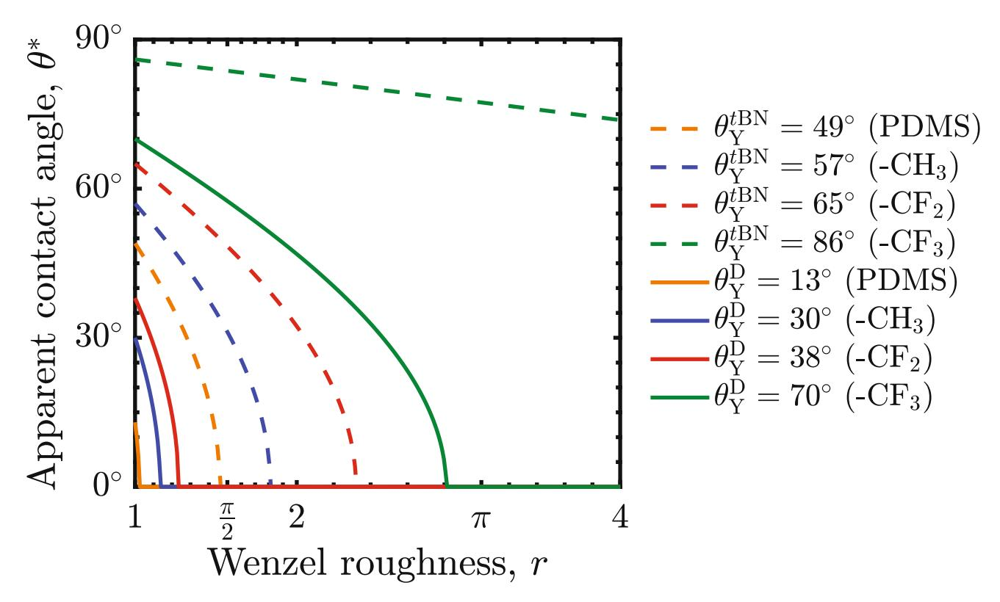

**Extended Data Fig. 1 | Contact angle of wetted fabrics for decane and** *tert***-butylnaphthalene.** Apparent contact angles of decane (D), γLV= 23.8 mN m−1 [42](#page-7-28), and *tert*-butylnaphthalene (*t*BN), γLV= 33.7 mN m−1 [45,](#page-7-31) on rough surfaces in terms of their Wenzel roughness, for four different surface chemistries: perfluorinated (-CF3), fluorinated (-CF2), alkyl (-CH3), and polydimthylsiloxane (PDMS). The values for the Young's contact angles of these two liquids on the four surface chemistries are found i[n45](#page-7-31).

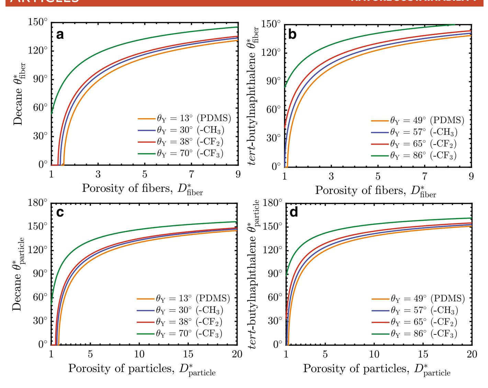

**Extended Data Fig. 2** | Wettability of non-wetted fibers and particles. **a**, Decane and **b**, tert-butylnaphthalene apparent contact angles on fibers,  $\theta_{fiber}^*$  considering four possible surface chemistries, against the porosity of the fibers,  $D_{fiber}^*$  **c**, Decane and **d**, tert-butylnaphthalene apparent contact angles on particles,  $\theta_{natticle}^*$ , considering four possible surface chemistries, against the porosity of the particles,  $D_{natticle}^*$ .

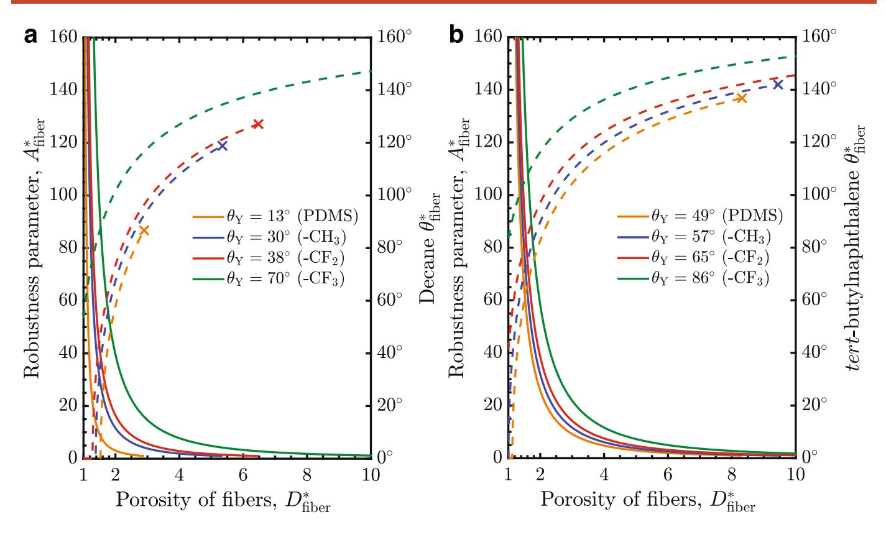

**Extended Data Fig. 3 | Robustness of fabrics.** The robustness parameter (solid lines),  $A_{\text{fiber}}^*$ , and apparent contact angle (dashed lines),  $\theta_{\text{fiber}}^*$  of **a**, decane and **b**, tert-butylnaphthalene on fibers against the porosity of the fibers,  $D_{\text{fiber}}^*$  considering four possible surface chemistries.

Articles **Nature Su Susstainnability ability**

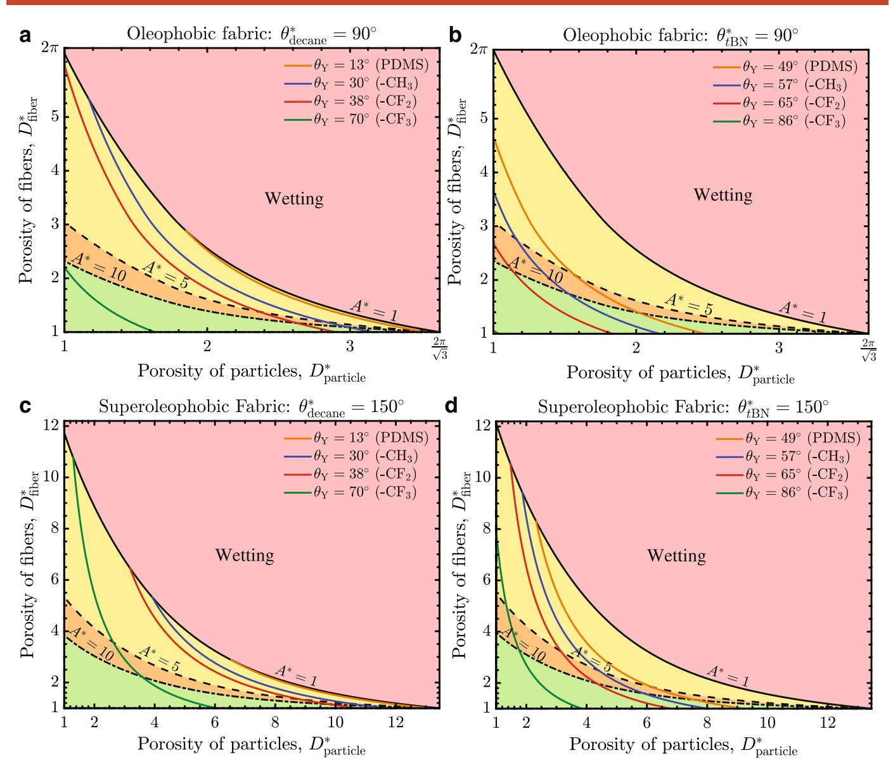

**Extended Data Fig. 4 | Design of robust, oil-repellent fabrics for other liquids.** Design diagrams for oleophobic fabrics considering **a**, decane (D) and **b**, *tert*-butylnaphthalene (*t*BN) as the low surface tension liquids. Design diagrams for superoleophobic fabrics considering **c**, decane (D) and **d**, *tert*-butylnaphthalene as the low surface tension liquids. In **a**–**d**, the porosity of the fabric, *D*\* fiber , is plotted against the porosity of the particles, *D*\* particle , for four possible surface chemistries. The assumed fiber diameter was *R*= 10 µm.

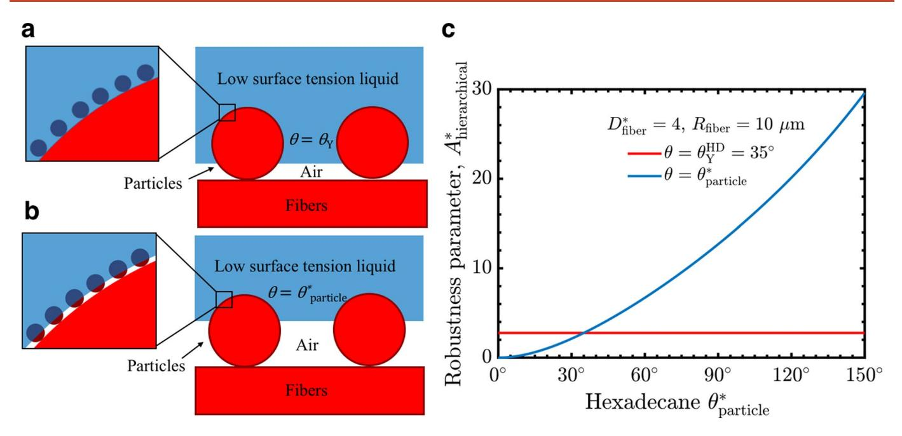

**Extended Data Fig. 5 | Meniscus position on hierarchical textures.** Schematic of a low surface tension liquid on fibers decorated with particles with the liquid meniscus sitting at  $\mathbf{a}$ , the fibers  $(\theta = \theta_{\gamma})$  and  $\mathbf{b}$ , the particles  $(\theta = \theta_{\text{particle}})$ .  $\mathbf{c}$ , The robustness parameter of fibers decorated by particles as a function of the assumed contact angle observed on the fibers. In Equation 5 we assume  $\theta = \theta_{\text{particle}}^*$  but previously  $\theta = \theta_{\gamma}$  has been assumed 37.

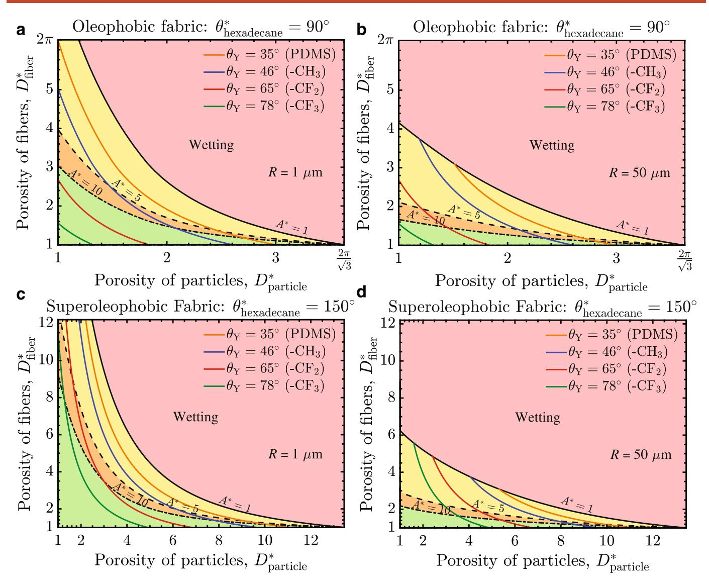

**Extended Data Fig. 6 | Design of robust, oil-repellent fabrics of different radii.** Hexadecane design diagrams for oleophobic fabrics with  ${\bf a}$ ,  $R=1\mu m$  and  ${\bf b}$ ,  $R=50 \mu m$ . Hexadecane design diagrams for superoleophobic fabrics with  ${\bf c}$ ,  $R=1 \mu m$  and  ${\bf d}$ ,  $R=50 \mu m$ . In  ${\bf a}$ - ${\bf d}$  the porosity of the fabric,  $D_{\rm fiber}^*$ , is plotted against the porosity of the particles,  $D_{\rm natticle}^*$ , for four possible surface chemistries.

**Nature Su Susstainnability ability**Articles

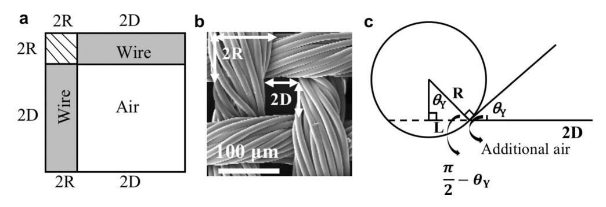

**Extended Data Fig. 7 | Geometric schematics of fibers. a**, A schematic of the woven metal meshes used in this work. **b**, SEM image of the nylon jacket fabric (*D\**≈ 1.5) indicating a unit cell of yarns and open area. **c**, Schematic diagram of the wire cross-section touching the liquid meniscus.